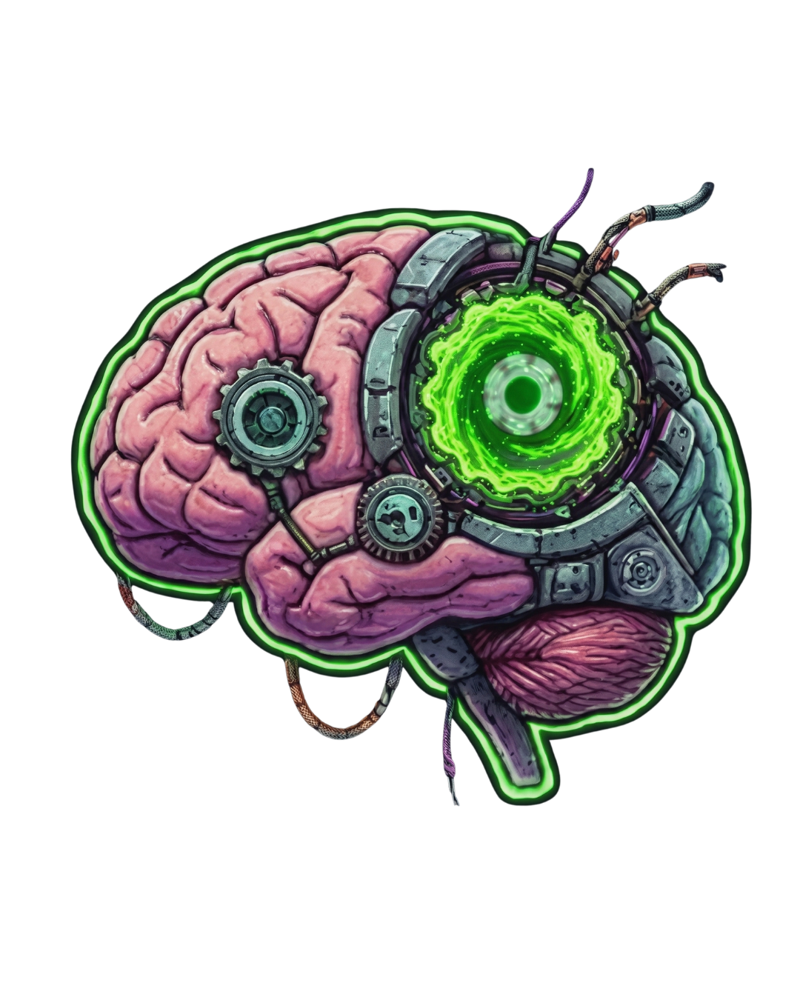
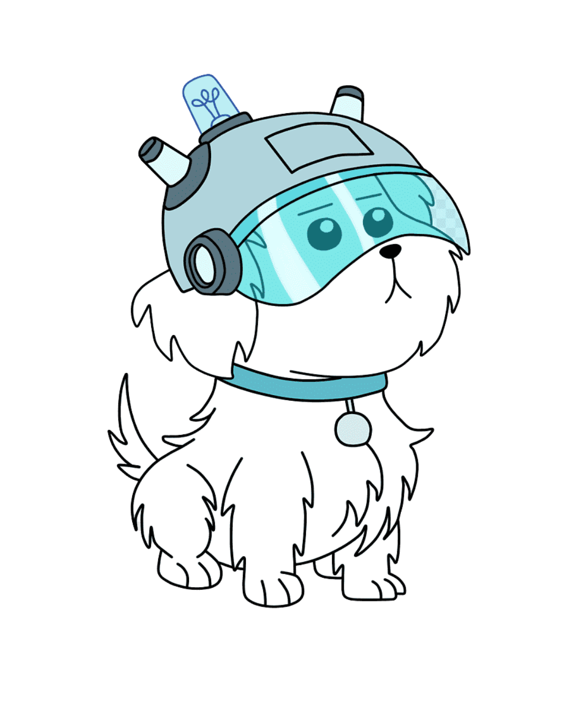

  
  

  

  
  
  
  
  

  <samp>
    <b>システムの分析と開発</b>
  </samp>

  

 

<h2 style="border-bottom: none; padding-bottom: 0;">About me</h2>

W L D D! Hello, I'm <strong>José Martines</strong>.

Systems Analysis and Development (ADS) student at IFRO, working practically with Data Analysis and Business Intelligence at a John Deere dealership network.

My focus is on transforming manual processes into automated solutions: I use Python to build RPAs that integrate systems and APIs, structuring pipelines and Power BI dashboards that support business decisions.

Code and data.

 

<h2 style="border-bottom: none; padding-bottom: 0;">Current Focus</h2>

 

<ul>
  <li>Data and insight generation, applying SOLID principles, programming paradigms, and ubiquitous language to align <strong>code and business</strong>.</li>
   
  <li>Intelligence extraction and creation of dynamic, efficient dashboards with <strong>Power BI and DAX</strong>.</li>
   
  <li>Refining my projects' architecture: readable code, layered structure (Controller-Service-Repository), and a focus on clean execution.</li>
   
  <li>Improving technical documentation and organization of ideas.</li>
</ul>

 

<h2 style="border-bottom: none; padding-bottom: 0;">Multiverse Metrics</h2>

  

  <table border="0" cellspacing="0" cellpadding="0" style="border: none; border-collapse: collapse;">
    <tr>
      <td align="center" valign="top" style="border: none; padding: 0 5px 0 0;">
        
      </td>
      <td align="center" valign="top" style="border: none; padding: 0 5px;">
        
      </td>
      <td align="center" valign="top" style="border: none; padding: 0 0 0 5px;">
        
      </td>
    </tr>
  </table>

 

<h2 style="border-bottom: none; padding-bottom: 0;">Stack and Tools</h2>

I use **Python** for automation and scripting, **JavaScript / TypeScript** for web or services, and **C#** for more structured systems. **SQL** and **MongoDB** for data modeling and persistence, and **Power BI** for analysis and dashboards. **Git** and **GitHub** for versioning with [Conventional Commits](https://www.conventionalcommits.org/), and **Docker** when I need the environment to be exactly the same on any machine.

 

**Languages & Frameworks**  

**Data & Databases**  

**DevOps, Infra & Testing**  

**Versioning & Tools**  

<h2 style="border-bottom: none; padding-bottom: 0;">Contact</h2>

 

  
    
  
    

 