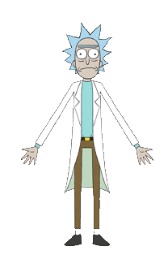
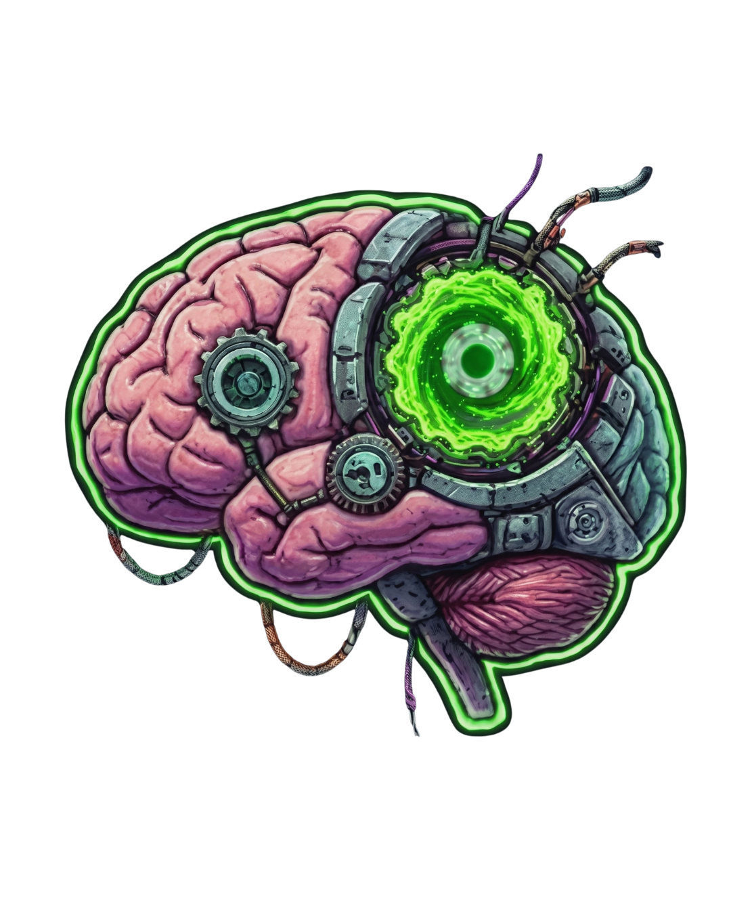
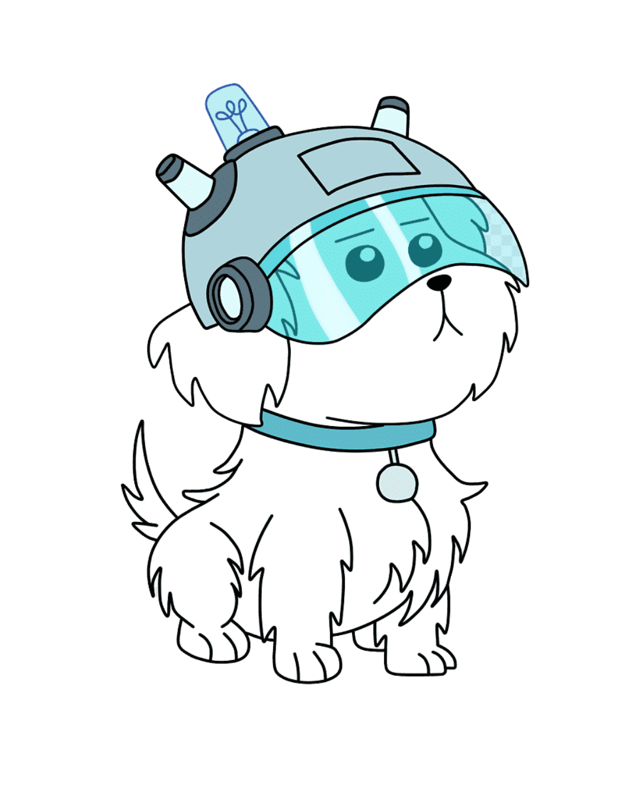
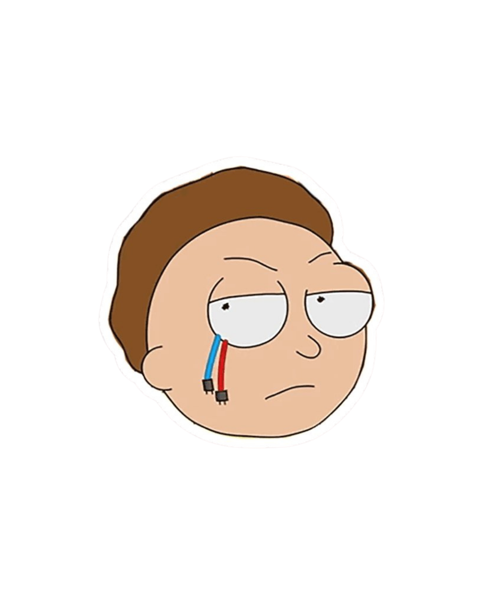

  

  
  
  
  
  

  <samp>
    <b>システムの分析と開発</b>
     
    Hi there! I'm Martines
     
  </samp>

  

 

<h2 style="border-bottom: none; padding-bottom: 0;">Sobre mim</h2>

Wubba Lubba Dub Dub! Olá, eu sou o <strong>José Martines</strong>.

Sou estudante de Análise e Desenvolvimento de Sistemas (ADS) no IFRO. Meu foco principal é na construção de sistemas práticos e na área de análise de dados (BI). Gosto de transformar processos manuais caóticos em fluxos eficientes e bem estruturados.

Trago bastante disciplina da minha vivência militar prévia para o meu código: prefiro ir direto ao ponto, mantendo o foco no desenvolvimento em si, criando lógicas sólidas no backend e modelando dados que realmente resolvam problemas no mundo real.

 

<h2 style="border-bottom: none; padding-bottom: 0;">Foco no momento</h2>

 

<ul>
  <li>Desenvolvimento de sistemas robustos e automações utilizando <strong>Python, Node.js e SQL</strong>.</li>
   
  <li>Extração de inteligência e criação de dashboards dinâmicos e eficientes com <strong>Power BI e DAX</strong>.</li>
   
  <li>Afinar a arquitetura dos meus projetos: código legível, estrutura em camadas (Controller-Service-Repository) e foco no funcionamento limpo.</li>
   
  <li>Melhorar a documentação técnica e organização das ideias.</li>
</ul>

 

 

<h2 style="border-bottom: none; padding-bottom: 0;">Métricas do Multiverso</h2>

  

  <table border="0" cellspacing="0" cellpadding="0" style="border: none; border-collapse: collapse;">
    <tr>
      <td align="center" valign="top" style="border: none; padding: 0 5px 0 0;">
        
      </td>
      <td align="center" valign="top" style="border: none; padding: 0 5px;">
        
      </td>
      <td align="center" valign="top" style="border: none; padding: 0 0 0 5px;">
        
      </td>
    </tr>
  </table>

 

<h2 style="border-bottom: none; padding-bottom: 0;">Stack e ferramentas</h2>

Uso **Python** para automação e scripts, **JavaScript / TypeScript** quando entra web ou serviço, e **C#** para sistemas mais estruturados. **SQL** e **MongoDB** para modelagem e persistência de dados, **Power BI** para análise e dashboards. **Git** e **GitHub** para versionamento com [Conventional Commits](https://www.conventionalcommits.org/), e **Docker** quando preciso que o ambiente seja o mesmo em qualquer máquina.

  
  
  
  
  
  
  
  
  
  

 

 

<h2 style="border-bottom: none; padding-bottom: 0;">Contato</h2>

 

  
    
  
    

 
 

